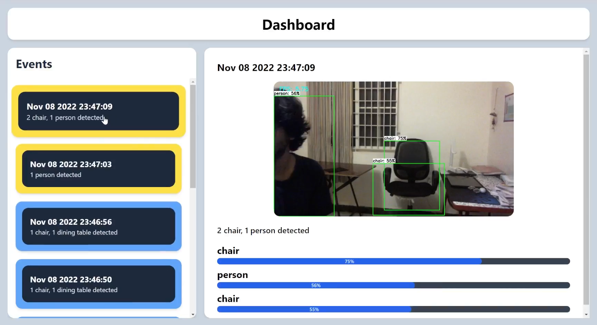

<!-- PROJECT LOGO -->

# `Real-Time Object Detection System using Raspberry Pi, TensorFlow, MERN and Socket.IO`

<!-- ABOUT THE PROJECT -->

## About The Project



In this project, a real-time object detection system has been developed that consists of a Raspberry Pi and a webcam for performing object detection along with a backend and a frontend for storing and viewing the data. The backend has been built using `Express`, `Socket.io` and `MongoDB Atlas`. The frontend has been built using `React` and `Tailwind CSS`.

The Raspberry Pi uses `ssd_mobilenet_v1.tflite` for performing object detection on the video stream from the webcam. The results from the object detection is then sent to the backend through a HTTP POST request which then gets stored in mongoDB Atlas. The frontend displays all the events that the Raspberry Pi generated with details such as the objects detected in a frame of the video stream, the image, the probability of the class of the detected objects and so on.

`Socket.IO` has been used for creating a bidirectional connnection between the backend and the frontend. When the backend recieves a new event from the Raspberry Pi, it updates the events displayed in the frontend in real-time.

## Frameworks and Technology Used

- Raspberry Pi and webcam for capturing the video stream and sending the events to the backend.
- TensorFlow for loading and using `ssd_mobilenet_v1.tflite` model on the captured video stream.
- Express for creating a REST API in the backend.
- MongoDB Atlas for storing the data in the cloud.
- Socket.IO for creating real-time bidirectional connection between backend and frontend.
- React for creating the frontend.
- Tailwindcss for styling the frontend.

<!-- GETTING STARTED -->

## Getting Started

### Backend and Frontend setup

1. Clone the repository.
   ```bash
   git clone https://github.com/Rahul-7323/Object-Detection-System-RPi.git
   ```
2. Create a `.env` file in the root of the `backend` folder with the same format as that of `.env.example` file and replace the dummy value of `MONGODB_URI` with an URL to a real MongoDB Atlas database. Optionally, change the value of the `PORT` variable to some other port of you choice.
3. Similarily, create a `.env` file in the root of the `frontend` folder with the same format as that of `.env.example` file and replace the values of `VITE_BACKEND_API_URL` and `VITE_BACKEND_SOCKET_URL` variables if you have deployed the backend or changed the port numbers to something else in the backend.
4. Run the below commands in the terminal to start the backend.
   ```bash
   cd backend
   yarn install
   yarn dev
   ```
5. Run the below commands in the terminal to start the frontend.
   ```bash
   cd frontend
   yarn install
   yarn dev
   ```

### Raspberry Pi Setup

1. Clone the repository.
   ```bash
   git clone https://github.com/Rahul-7323/Object-Detection-System-RPi.git
   ```
2. Replace the value of `url` variable in the `detect_webcam.py` file in the `raspberry_pi` folder to the URL of the backend.
3. Run the below commands in the terminal of the Raspberry Pi to start the object detection process.
   ```bash
   cd Object-Detection-System-RPi/raspberry_pi
   source setup.sh
   python3 detect_webcam.py --modeldir object_detection_model
   ```

## Usage

For doubts related to usage of this project, watch the [demo video](https://drive.google.com/file/d/1jlMMihbOwFs_UxfUVcTRDTs2j2JIuGuP/view?usp=share_link).
